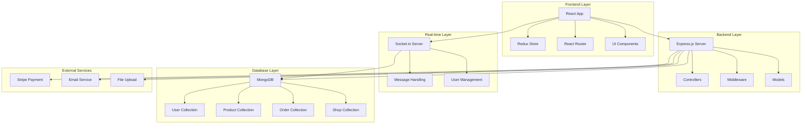
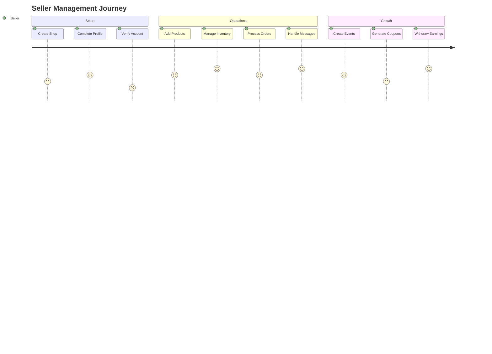
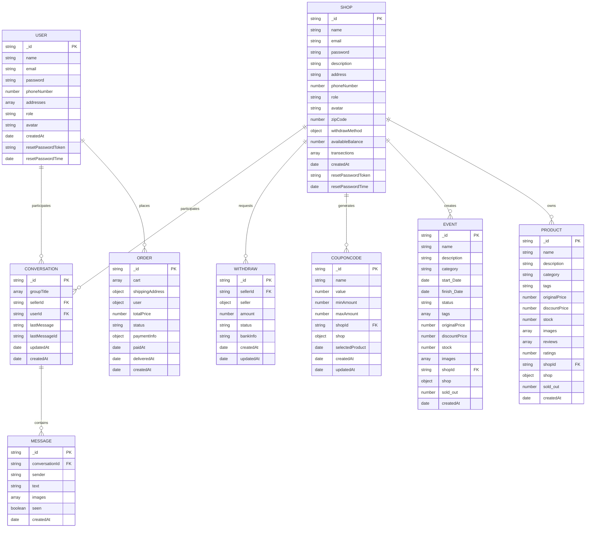

# 🛒 E_Shop - Full-Stack E-Commerce Platform

A modern, feature-rich e-commerce platform built with React, Node.js, and MongoDB. This multi-vendor marketplace supports both customers and sellers with real-time messaging, payment processing, and comprehensive admin management.

## 📋 Table of Contents

- [Overview](#overview)
- [Features](#features)
- [System Architecture](#system-architecture)
- [User Flows](#user-flows)
- [Database Schema](#database-schema)
- [Technology Stack](#technology-stack)
- [Project Structure](#project-structure)
- [Installation & Setup](#installation--setup)
- [API Documentation](#api-documentation)
- [Deployment](#deployment)
- [Contributing](#contributing)

## 🎯 Overview

E_Shop is a comprehensive e-commerce solution that enables:
- **Multi-vendor marketplace** with seller registration and management
- **Real-time messaging** between customers and sellers
- **Secure payment processing** with Stripe integration
- **Admin dashboard** for platform management
- **Order tracking** and management system
- **Event management** for promotions and sales

## ✨ Features

### 🛍️ Customer Features
- User registration and authentication
- Product browsing and search
- Shopping cart and wishlist
- Secure checkout process
- Order tracking and history
- Real-time messaging with sellers
- Product reviews and ratings
- Event participation

### 🏪 Seller Features
- Shop creation and management
- Product listing and inventory management
- Order management and fulfillment
- Sales analytics and reporting
- Withdrawal management
- Event creation and management
- Coupon code generation
- Real-time customer communication

### 👨‍💼 Admin Features
- User and seller management
- Product and order oversight
- Event management
- Withdrawal request processing
- Platform analytics
- Content moderation

## 🏗️ System Architecture



## 🔄 User Flows

### Customer Journey


### Seller Journey


## 🗄️ Database Schema



## 🛠️ Technology Stack

### Frontend
- **React 18** - UI framework
- **Redux Toolkit** - State management
- **React Router** - Client-side routing
- **Tailwind CSS** - Styling
- **Material-UI** - Component library
- **Axios** - HTTP client
- **Socket.io Client** - Real-time communication
- **Stripe React** - Payment processing

### Backend
- **Node.js** - Runtime environment
- **Express.js** - Web framework
- **MongoDB** - Database
- **Mongoose** - ODM
- **JWT** - Authentication
- **Bcrypt** - Password hashing
- **Multer** - File upload handling
- **Nodemailer** - Email service
- **Socket.io** - Real-time communication

### External Services
- **Stripe** - Payment processing
- **Cloudinary** - Image storage (configured but not active)
- **MongoDB Atlas** - Cloud database

## 📁 Project Structure

```
E_Shop/
├── frontend/                 # React application
│   ├── public/              # Static assets
│   ├── src/
│   │   ├── components/      # Reusable components
│   │   │   ├── Admin/       # Admin-specific components
│   │   │   ├── Cart/        # Shopping cart components
│   │   │   ├── Checkout/    # Checkout process components
│   │   │   ├── Events/      # Event-related components
│   │   │   ├── Layout/      # Layout components
│   │   │   ├── Login/       # Authentication components
│   │   │   ├── Payment/     # Payment components
│   │   │   ├── Products/    # Product-related components
│   │   │   ├── Profile/     # User profile components
│   │   │   ├── Shop/        # Seller dashboard components
│   │   │   └── Wishlist/    # Wishlist components
│   │   ├── pages/           # Page components
│   │   ├── redux/           # State management
│   │   ├── routes/          # Route definitions
│   │   └── styles/          # Styling files
│   └── package.json
├── backend/                 # Node.js API server
│   ├── controller/          # Route handlers
│   ├── middleware/          # Custom middleware
│   ├── model/              # Database models
│   ├── utils/              # Utility functions
│   ├── uploads/            # File uploads
│   └── package.json
├── socket/                 # Socket.io server
│   ├── index.js           # Socket server setup
│   └── package.json
└── readme.md              # Project documentation
```

## 🚀 Installation & Setup

### Prerequisites
- Node.js (v14 or higher)
- MongoDB (local or Atlas)
- Yarn or npm

### Environment Variables
Create `.env` files in both `backend/` and `socket/` directories:

**Backend .env:**
```env
PORT=8000
URI=your_mongodb_connection_string
JWT_SECRET_KEY=your_jwt_secret
JWT_EXPIRES=7d
ACTIVATION_SECRET=your_activation_secret
SMTP_HOST=your_smtp_host
SMTP_PORT=587
SMTP_USER=your_email
SMTP_PASSWORD=your_password
STRIPE_SECRET_KEY=your_stripe_secret_key
STRIPE_API_KEY=your_stripe_api_key
CLIENT_URL=http://localhost:3000
```

**Socket .env:**
```env
PORT=8001
```

### Installation Steps

1. **Clone the repository**
   ```bash
   git clone <repository-url>
   cd E_Shop
   ```

2. **Install backend dependencies**
   ```bash
   cd backend
   yarn install
   # or
   npm install
   ```

3. **Install frontend dependencies**
   ```bash
   cd ../frontend
   yarn install
   # or
   npm install
   ```

4. **Install socket dependencies**
   ```bash
   cd ../socket
   yarn install
   # or
   npm install
   ```

5. **Start the servers**

   **Terminal 1 - Backend:**
   ```bash
   cd backend
   yarn dev
   # or
   npm run dev
   ```

   **Terminal 2 - Frontend:**
   ```bash
   cd frontend
   yarn start
   # or
   npm start
   ```

   **Terminal 3 - Socket:**
   ```bash
   cd socket
   yarn dev
   # or
   npm run dev
   ```

6. **Access the application**
   - Frontend: http://localhost:3000
   - Backend API: http://localhost:8000
   - Socket Server: http://localhost:8001

## 📚 API Documentation

### Authentication Endpoints
- `POST /api/user/create-user` - User registration
- `POST /api/user/activation` - Email activation
- `POST /api/user/login-user` - User login
- `POST /api/user/logout` - User logout
- `GET /api/user/getuser` - Get user profile
- `PUT /api/user/update-user-info` - Update user profile
- `PUT /api/user/update-avatar` - Update user avatar
- `PUT /api/user/update-user-addresses` - Update user addresses
- `DELETE /api/user/delete-user-address/:id` - Delete user address
- `PUT /api/user/update-user-password` - Update password
- `POST /api/user/forgot-password` - Forgot password
- `POST /api/user/reset-password` - Reset password

### Product Endpoints
- `GET /api/products/get-all-products` - Get all products
- `GET /api/products/get-all-products-shop/:id` - Get products by shop
- `DELETE /api/products/delete-shop-product/:id` - Delete product
- `GET /api/products/admin-all-products` - Admin get all products
- `POST /api/products/create-product` - Create product
- `PUT /api/products/update-product/:id` - Update product
- `GET /api/products/get-product/:id` - Get single product
- `POST /api/products/create-review` - Create product review
- `DELETE /api/products/delete-review` - Delete review

### Order Endpoints
- `POST /api/order/create-order` - Create order
- `GET /api/order/get-all-orders-user/:id` - Get user orders
- `GET /api/order/get-all-orders-shop/:id` - Get shop orders
- `PUT /api/order/update-order-status/:id` - Update order status
- `PUT /api/order/update-order-refund/:id` - Update refund status
- `GET /api/order/admin-all-orders` - Admin get all orders

### Shop Endpoints
- `POST /api/shop/create-shop` - Create shop
- `POST /api/shop/activation` - Shop activation
- `POST /api/shop/login-shop` - Shop login
- `GET /api/shop/getshop` - Get shop profile
- `PUT /api/shop/update-shop-avatar` - Update shop avatar
- `PUT /api/shop/update-shop-info` - Update shop info
- `PUT /api/shop/update-shop-settings` - Update shop settings
- `PUT /api/shop/update-payment-methods` - Update payment methods
- `PUT /api/shop/update-withdraw-methods` - Update withdraw methods
- `DELETE /api/shop/delete-withdraw-method` - Delete withdraw method

### Payment Endpoints
- `POST /api/payment/process` - Process payment
- `GET /api/payment/stripeapikey` - Get Stripe API key

### Event Endpoints
- `POST /api/event/create-event` - Create event
- `GET /api/event/get-all-events` - Get all events
- `GET /api/event/get-all-events-shop/:id` - Get shop events
- `DELETE /api/event/delete-shop-event/:id` - Delete event
- `GET /api/event/admin-all-events` - Admin get all events

### Coupon Code Endpoints
- `POST /api/coupon-code/create-coupon` - Create coupon
- `GET /api/coupon-code/get-coupon/:id` - Get coupon
- `DELETE /api/coupon-code/delete-coupon/:id` - Delete coupon
- `GET /api/coupon-code/get-coupon-value/:name` - Get coupon value

### Withdraw Endpoints
- `POST /api/withdraw/create-withdraw` - Create withdraw request
- `GET /api/withdraw/get-all-withdraw-request` - Get all withdraw requests
- `PUT /api/withdraw/update-withdraw-status/:id` - Update withdraw status

### Message Endpoints
- `POST /api/message/create-new-message` - Create message
- `GET /api/message/get-all-messages/:id` - Get all messages

## 🚀 Deployment

### Frontend Deployment (Vercel/Netlify)
1. Build the frontend:
   ```bash
   cd frontend
   yarn build
   ```

2. Deploy to your preferred platform
3. Update API endpoints in `server.js` to production URLs

### Backend Deployment (Heroku/Railway)
1. Create production environment variables
2. Deploy backend code
3. Ensure MongoDB connection is configured

### Socket Server Deployment
1. Deploy socket server separately
2. Update socket connection URL in frontend

## 🤝 Contributing

1. Fork the repository
2. Create a feature branch (`git checkout -b feature/AmazingFeature`)
3. Commit your changes (`git commit -m 'Add some AmazingFeature'`)
4. Push to the branch (`git push origin feature/AmazingFeature`)
5. Open a Pull Request

## 📄 License

This project is licensed under the MIT License - see the [LICENSE](LICENSE) file for details.

## 👨‍💻 Author

**Ameer Hamza**
- GitHub: [@ameerhamza](https://github.com/ameerhamza)

## 🙏 Acknowledgments

- React community for excellent documentation
- Express.js team for the robust framework
- MongoDB team for the flexible database
- Stripe for seamless payment integration
- Socket.io for real-time communication

---

**Happy Shopping! 🛒✨**
